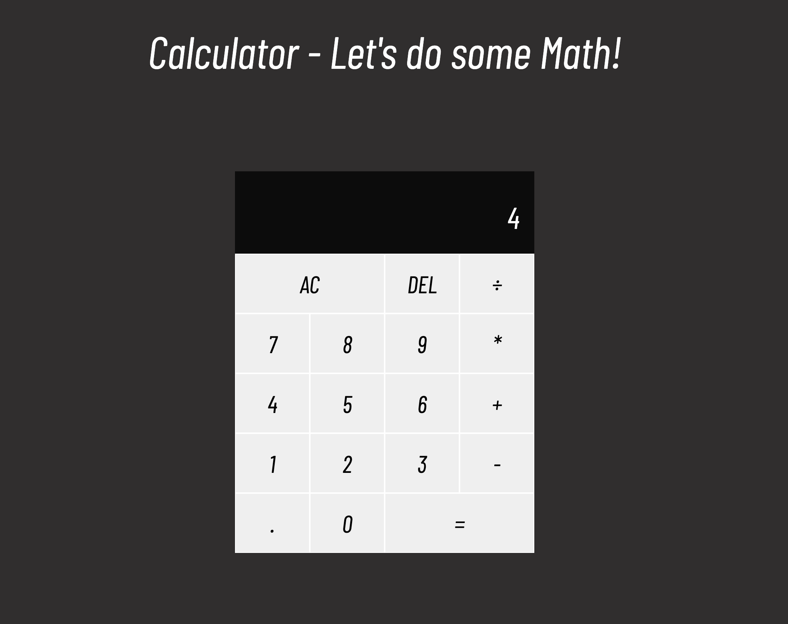

# Calculator

---

This is project #4 from The Odin Project that encompassed everything that I've learned so far. The prjoect was to make an on-screen calculator using JavaScript, HTML, and CSS.

---

